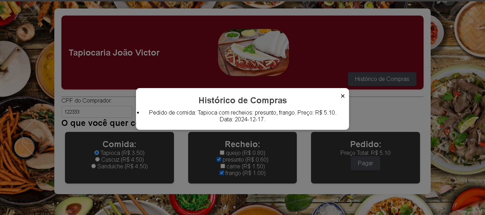
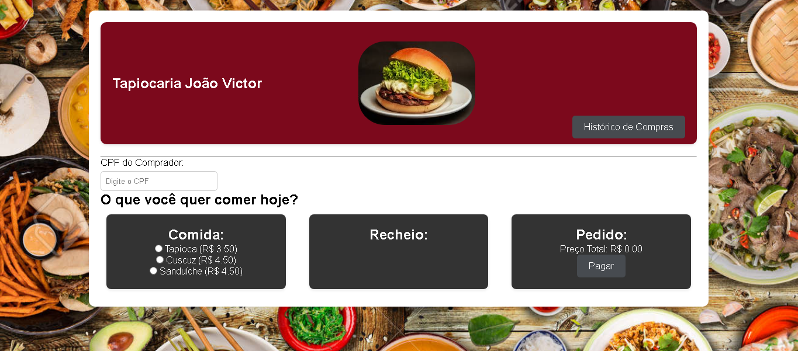
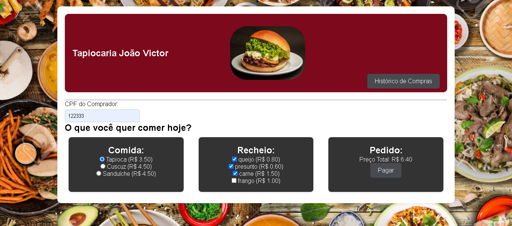
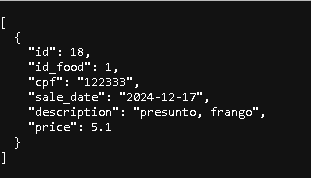
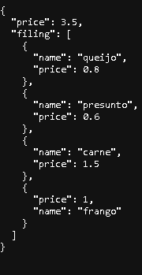

# Tapiocaria
Este projeto utiliza uma API que foi feita no Intellij com a liguagem kotlin que permite pegar os recheios disponiveis, salvar a compra e ver o histórico de compra por CPF. 

## Funcionalidades
- Trazer os recheios disponiveis.
- Ver o histórico de compras pelo cpf informado: com a comida, os recheios e o valor total da compra.
- Enviar para o banco o id da comida selecionada, a descrição com o nome dos recheios e o valor total.

## Desegin do Projeto
### Popup do Historico de compras


### Tela Inicial


### Tela com as a comida e os recheios selecionados


## URL usadas

Para fazer o pagamento:
```
http://localhost:8080/payment
```
Para ver o histórico de compras:
```
http://localhost:8080/history?cpf=
```
Resposta:


Para trazer os recheios:
```
http://localhost:8080/food?id=
```
Resposta:
